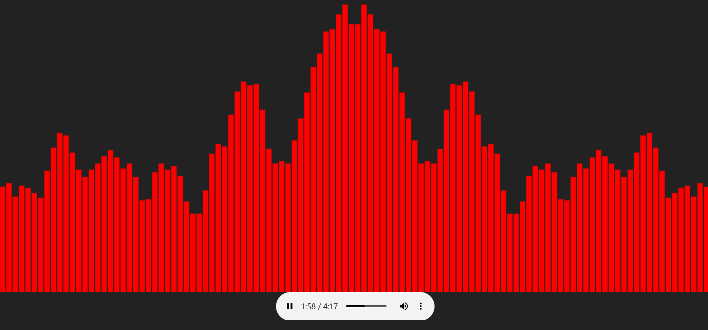

# AudioToShow is a JavaScript package to visualizes audio

## use

### You need a target node, which will be used for visual presentation

```html
<div id="container"></div>
```

### options object

```javascript
options = {
    /**
     * 插入乐谱根元素
     */
    el: HTMLDivElement,
    // cvs: HTMLCanvasElement,
    /**
     * 音乐url链接
     */
    url: string
    /**
     * color 乐谱颜色,默认红色
     */
    color?: string
    /**
     * size 乐谱每格宽度,默认为1
     */
    size?: number
}
```

### Pass the configuration to audioToShow

```javascript
const el = document.getElementById('container')
const url =
    'https://dl.stream.qqmusic.qq.com/C4000004d30U0tsdrH.m4a?guid=5306109274&vkey=396BC7D7A2B9B22E14854BEC5D7FA7637553FA74D934FD77F9513EC0C42D9C34EC3A955680AFAC5780842B5A442C48BE693650E20F3B4AEA&uin=&fromtag=120032'
initToShow({ el, url, color: 'yellow', size: 4 })
```

### you will get it


